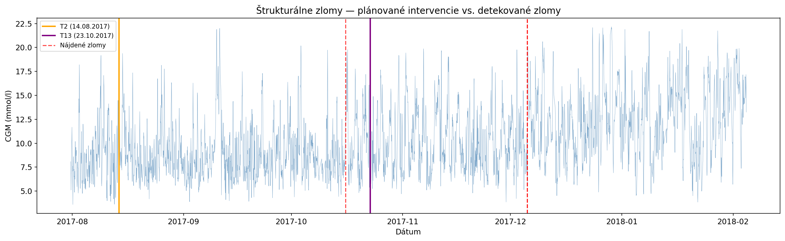
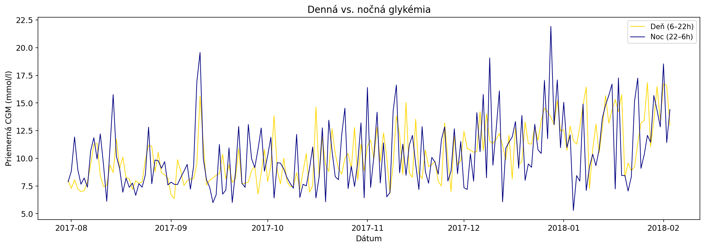
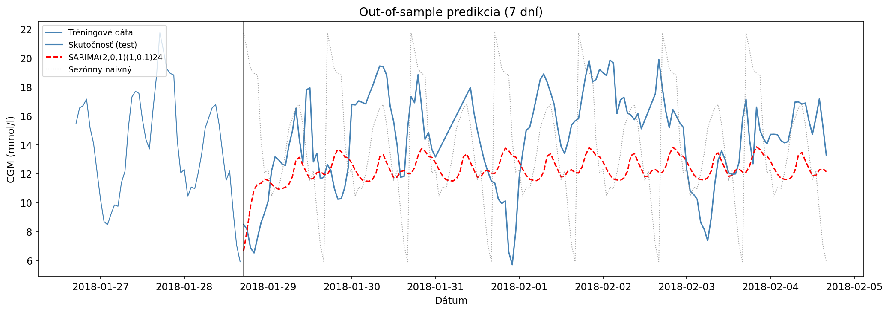

```{r}
#| label: setup
#| include: false
library(dplyr)
library(ggplot2)
library(plotly)
library(readr)

d <- "data/"
prof <- read_csv(paste0(d, "denny_profil.csv"), show_col_types = FALSE)
```

Merač glukózy prilepený na ramene dnes nosí diabetik aj biohacker, čo si stráži formu. Ja glykémiu najmä ako mama diabetika od útleho detstva. Keď som sa naučila nástroje časových radov, tak glykémie v čase boli ideálnym kandidátom na preskúmanie. Ako štatističku ma zaujíma viac než len okamžitá hodnota na displeji: keď má človek za sebou pol roka meraní každú hodinu, **čo z toho radu vyčítajú nástroje časových radov?** Vzala som verejne dostupné dáta jedného pacienta z klinickej štúdie a pustila sa do nich. Ukázalo sa, že: **po plánovanom prestavení inzulínových dávok lekárom, ktorý mal pomôcť, sa v dátach prejavilo zreteľné zhoršenie.**

## Aké dáta boli k dispozícii

Dáta pochádzajú z klinickej štúdie **iDCL Trial / DCLP3** (detaily sú na mojom Githube - ako sa k nim dostať, je nižšie v časti „Pre zvedavých"), ktorá porovnávala inzulínovú pumpu s uzavretým okruhom s bežnou senzorovou pumpou. V dátach nevidno, čo a kedy pacienti jedli, ani koľko inzulínu si kedy dali — v dátach sú len hodnoty glykémie, nie jej príčiny.

Vybrala som si jedného **plne anonymizovaného pacienta** s diabetom 1. typu a jeho merania senzora agregovala, teda spriemerovala 5-minúzové údaje za hodinu a získala **4 515 pozorovaní počas 188 dní** (júl 2017 – február 2018). Súčasťou dát sú aj dva termíny, kedy lekári upravovali nastavenia pumpy — v **2. a v 13. týždni** štúdie.
Tento pacient mal priemernú glykémiu **10,4 mmol/l** (medián 9,6), a v cieľovom pásme 3,9–10,0 mmol/l (klinicky 70–180 mg/dl) strávil **53 % času**. Zvyšok bol prevažne nad odporúčanou hladinou glykémie.

## Čo sa z nich dalo zistiť

**Deň má svoj rytmus.** Ako prvé sa ukázala silná 24-hodinová sezónnosť, čo je v podstate samozrejmé. Priemerný deň pacienta má rozpoznateľný tvar: nadránom je glykémia najnižšie (okolo 5.–6. hodiny), potom prudko stúpne k raňajkám, cez obed klesne a **najvyššie je večer, okolo 20. hodiny**. To ranné stúpanie ešte pred prvým sústom je učebnicový *syndróm brieždenia*.

```{r}
#| label: fig-denny-profil
#| fig-cap: "Priemerný denný profil glykémie po hodinách (modrá = medzikvartilové rozpätie, zelená = cieľová hodnota 3,9–10,0 mmol/l)."
g <- ggplot(prof, aes(hodina, priemer_mmol)) +
  annotate("rect", xmin = -0.5, xmax = 23.5, ymin = 3.9, ymax = 10,
           alpha = 0.12, fill = "seagreen") +
  geom_ribbon(aes(ymin = q25_mmol, ymax = q75_mmol),
              alpha = 0.15, fill = "steelblue") +
  geom_line(colour = "steelblue", linewidth = 1) +
  geom_point(colour = "steelblue", size = 1.6) +
  scale_x_continuous(breaks = seq(0, 24, 3)) +
  scale_y_continuous(breaks = seq(0, 14, 1),
                     limits = c(0, NA), expand = expansion(mult = c(0, 0.05))) +
  labs(x = "hodina dňa", y = "priemerná glykémia (mmol/l)") +
  theme_minimal() +
  theme(axis.line.x = element_line(colour = "grey70"),
        panel.grid.minor = element_blank())
ggplotly(g) |> layout(font = list(family = "sans-serif"),
                      xaxis = list(showline = TRUE, linecolor = "grey70", ticks = "outside"))
```

**Zásah, ktorý uškodil(?).** V 13. týždni lekári upravili nastavenia pumpy — a namiesto zlepšenia prišiel prepad. **Čas v cieľovom pásme klesol zo 74 % pred úpravami na 39 % po nej**, priemerná glykémia stúpla z 8,7 na 11,5 mmol/l. Tu je ale trochu háčik. Keď som spustila test, ten potvrdil zhoršenie po úprave. Keď som však cez Chow test dala nájsť automaticky **štrukturálny zlom**, ten ho našiel o niečo skôr. To teda skôr vypovedá o tom, že glykémie sa zmenili ešte pred lekárskou intervenciou v 13. týždni. A tá to možno zmiernila alebo naopak zhoršila. U tohto pacienta sa teda po zásahu zmenil podiel time-in-range (čas v želanom rozsahu), ale nemôžeme tvrdiť, že to bolo práve tou intervenciou.



**Deň vplyvňuje noc, ale nie naopak.** Rozdelila som rad na denné a nočné hodnoty a testovala, či jedno pomáha predpovedať druhé. Je na to nástroj, ktorý sa volá **Grangerova kauzalita**. Výsledok je pekne **asymetrický: denná glykémia predpovedá nočnú (p = 0,005), ale opačný smer neplatí (p = 0,28)**. Fyziologicky to dáva zmysel — jedlo a aktivita cez deň formujú nočný profil, kým noc už len „dobieha" deň. Ak by sme skúmali koreláciu, zistili by sme len, že deň a noc spolu súvisia, ale nepoznali by sme smer vzťahu; ten odhalí až test kauzality.



**Zložitejší model nebol lepší ako ten najhlúpejší.** Keďže pumpy s uzavretým okruhom v podstate robia krátkodobú predikciu (koľko inzulínu dávkovať, aby o hodinu bola glykémia v norme), skúsila som predikovať aj ja — modelom SARIMA, ktorý zachytáva dennú sezónnosť. To znamená, že v podstate pozná tú dennú variabilitu (krivku). Tento sezónny model bol o trochu lepší v predikcii ako úplne naivný odhad, ktorý jednoducho zopakuje poslednú hodnotu. Lenže keď som rozdiel overila **Diebold-Marianovým testom, nebol štatisticky signifikantný.** Poctivý záver teda znie: na hodinovej predikcii glykémie sa jednoduchá „persistencia" prekonáva prekvapivo ťažko. Vidno to aj na grafe — SARIMA (červená) sa drží blízko priemeru a veľké výkyvy nezachytí.



**Volatilita** Tú poznajú asi skôr ľudia od financií. Volatilita je o tom, ako veľmi sa hodnoty menia. Pri diabete nie je veľmi žiadúce, aby glkémia "letala hore-dole". Preto som sa pozrela aj na volatilitu (GARCH) v jednotlivých obdobiach - po zmene nastavení. Hneď po prvom prestavení v 2. týždni sa volatilita (kolísanie glykémií) znížila. A hoci sa po 13. týždni zhoršil *priemer*, samotná kolísavosť ostala zhruba rovnaká. Priemer a stabilita sú dve rôzne veci — dá sa zhoršiť v jednom a nezmeniť v druhom.

## Kde sa tento postup dá použiť

Hladina cukru v krvi má s faktúrami málo spoločného — ale **metódy** sú prenosné jedna k jednej. Nástroje na hľadanie štrukturálnych zlomov, skúmanie volatility, či predikcie sú užitočné pre firemné dáta, ktoré sú typickými časovými radmi.

**Zmenilo sa niečo po tom, čo sme zasiahli?** Zmenili ste cenu, spustili kampaň, prekopali proces — a teraz sa hádate, či to zabralo. To isté, čo tu odhalilo zhoršenie po úprave pumpy, vie na firemných dátach povedať, či sa metrika (predaj, reklamačnosť, doba dodania) po vašom zásahu **naozaj zlomila**, alebo len prirodzene kolíše. Chow test a CUSUM rozhodnú namiesto pocitu — a poistia vás aj pred opačným omylom: mysleli ste, že to pomohlo, a pritom to uškodilo.

**Sledujte kolísavosť, nielen priemer.** Priemerný obrat, priemerná doba dodania či priemerná spotreba vyzerajú pekne — a pritom môžu skrývať divokú nestabilitu. Rovnaký GARCH prístup, ktorý meria kolísavosť glykémie, ukáže, či sú vaše dodávky, tržby alebo náklady **stabilné, alebo len náhodou práve sedia na priemere.** Vysoká volatilita je samostatné riziko, aj keď priemer vyzerá v poriadku.

**Čo predbieha, čo ovplyvňuje.** Že dve veci súvisia, viete aj bez štatistiky. Otázka za peniaze je, **ktorá vedie ktorú**: predbieha dopyt stav skladu, alebo naopak? Ťahá marketing predaj, alebo predaj marketing? Grangerova kauzalita — tá istá, čo tu ukázala, že deň riadi noc — vie z dvoch časových radov vytiahnuť *smer* vzťahu, nielen jeho silu.

**Krátkodobá predikcia.** Návštevnosť, predaj či záťaž majú svoje denné a týždenné vzory a dajú sa predpovedať z vlastnej histórie. Tento príbeh je ale zároveň zdravé memento: **skôr než nasadíte zložitý model, porovnajte ho s najhlúpejším možným benchmarkom.** Ak „zopakuj včerajšok" nie je preukázateľne horší, drahý model si nezaslúžil svoju cenu. Overenie rozdielu (Diebold-Mariano) je lacná poistka proti sebaklamu.

## Pre zvedavých a technicky zdatných

Celá analýza — príprava dát, STL dekompozícia, SARIMA, štrukturálne zlomy, GARCH aj Grangerova kauzalita — je v Python notebookoch na GitHube:
[time-series-econometrics / 03-cgm-glucose-analysis](https://github.com/danakozakova/time-series-econometrics/tree/main/03-cgm-glucose-analysis). Notebooky majú uložené všetky výstupy, takže výsledky si prezriete aj bez prístupu k dátam.

Dáta pochádzajú z klinickej štúdie DCLP3, ktorú poskytuje Jaeb Center for Health Research ([public.jaeb.org/dataset/573](https://public.jaeb.org/dataset/573)); prístup je individuálny a **redistribúcia nie je povolená** — na tejto stránke je preto len neidentifikovateľný hodinový agregát. Referencia štúdie: Brown, S. A., et al. (2019). *Six-Month Randomized, Multicenter Trial of Closed-Loop Control in Type 1 Diabetes.* New England Journal of Medicine, 381(18), 1707–1717.

## Ak máte dáta a otázky
- neváhajte ma kontaktovať. Rada sa na vaše dáta pozriem a poviem, čo sa z nich dá zistiť.
