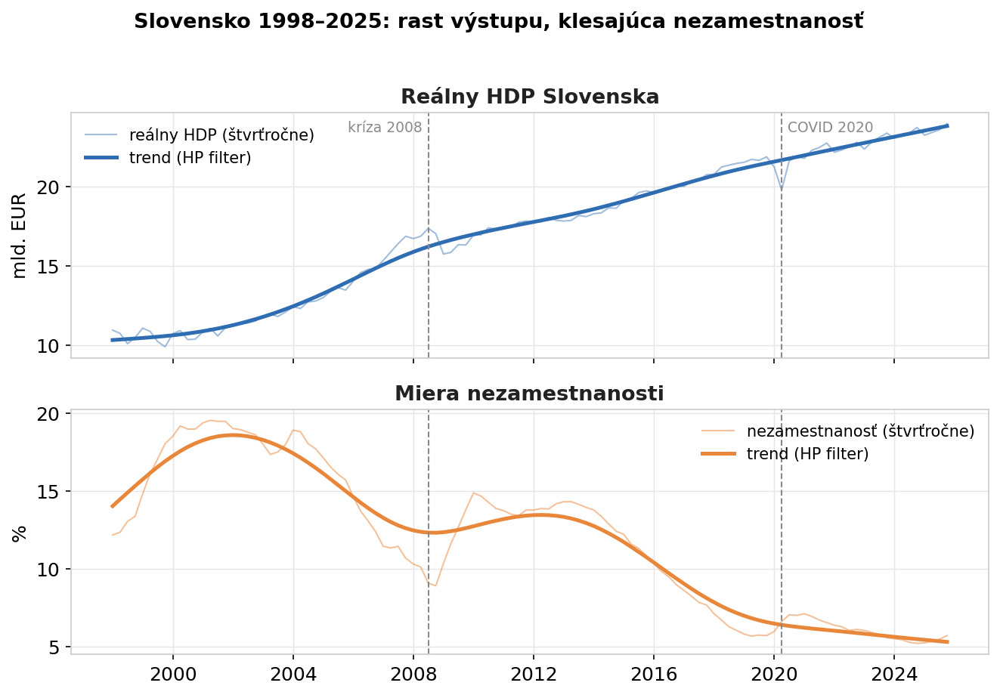
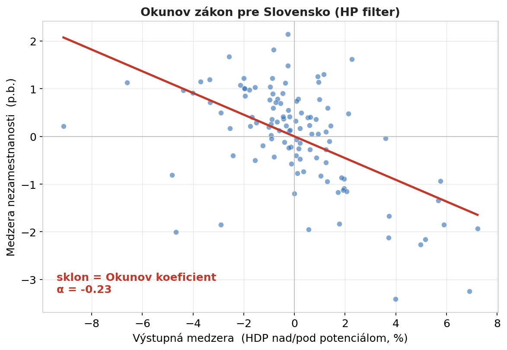
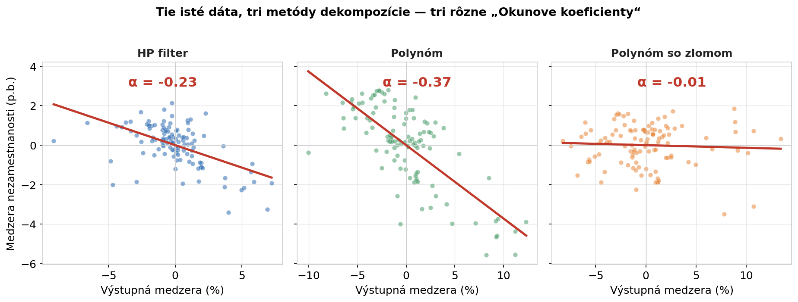
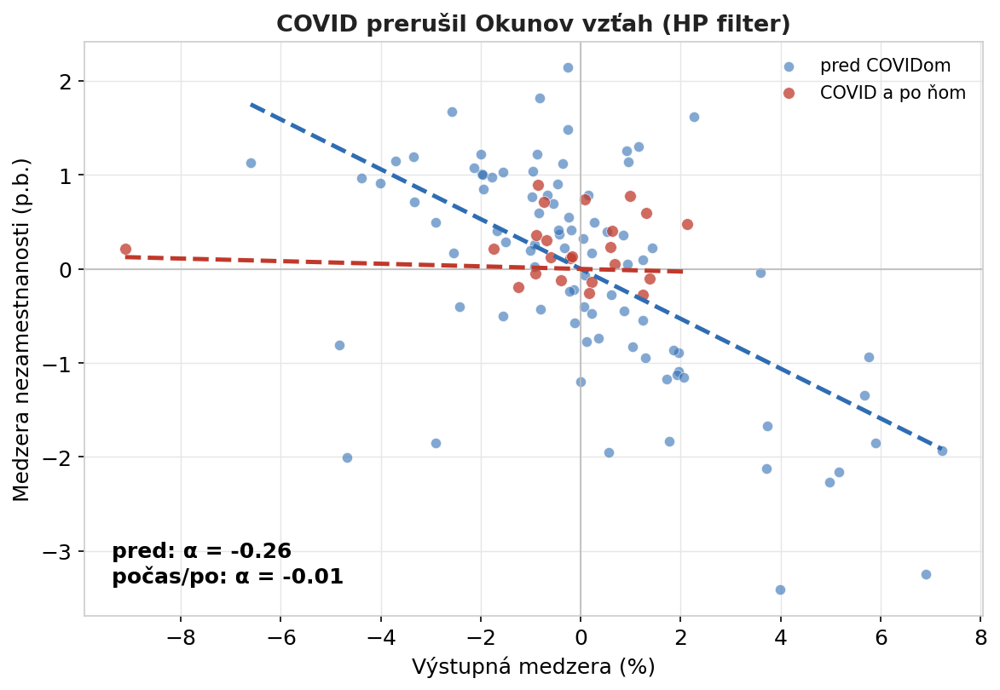

Ekonomická učebnica to podáva ako pravidlo: *keď HDP klesne o pár percent pod svoj potenciál, nezamestnanosť stúpne o toľko-a-toľko.* Volá sa to Okunov zákon a znie to ako fyzikálna konštanta — jedno číslo, ktoré platí vždy a všade. Skúsila som ten „zákon" odhadnúť na slovenských dátach za posledných takmer tridsať rokov a vyšlo mi niekoľko hodnôt tohto parametra. Hodnota sa mení podľa metódy a obdobia.

## Aké dáta boli k dispozícii

Pracovala som so štvrťročným **reálnym HDP** a **mierou nezamestnanosti Slovenska** z databázy [FRED](https://fred.stlouisfed.org) (Federal Reserve Economic Data), za obdobie Q1/1998 – Q4/2025. To okno pokrýva dve väčšie neštandardné obdobia: finančnú krízu 2008–2009 aj pandémiu COVID-19.

Okunov zákon nehovorí o samotnom HDP a nezamestnanosti, ale o ich *cyklickej zložke* — o tom, o koľko je ekonomika nad alebo pod svojím „normálom". Ten normál — potenciálny produkt a prirodzená miera nezamestnanosti — sú však teoretickými hodnotami. Nie sú to údaje, ktorý by niekto zbieral; je to konštrukt, ktorý treba z dát vypočítať. A práve tu sa začína problém: podľa toho, akou metódou trend od cyklu oddelíte, dostanete iné „medzery" — a tým iný Okunov koeficient. 

Centrálne banky a finančné inštitúcie majú na to modely, ako tieto teoretické hodnoty vypočítať. Avšak sezónne očistený rad HDP bol vo FREDe dostupný len do roku 2020, takže som pracovala so sezónne neočistenou sériou a očistenie, teda tú teoretickú hodnotu, som si odvodila sama.

## Čo som zistila z dát

**Rast výstupu, klesajúca nezamestnanosť.** Za tie tri dekády slovenská ekonomika zhruba zdvojnásobila reálny výstup a nezamestnanosť klesla z takmer 20 % na 6 %. Obe krivky ale nejdú priamočiaro nahor — vidno na nich krízu 2008 aj covidový prepad 2020.

**Okunov zákon.** Keď proti sebe vynesieme výstupnú medzeru (o koľko % je HDP nad/pod potenciálom) a medzeru nezamestnanosti (o koľko p.b. je nad/pod prirodzenou úrovňou), dostaneme klesajúci mrak bodov: keď ekonomika beží nad potenciál, nezamestnanosť je pod svojím normálom, a naopak. Sklon tej priamky **je** Okunov koeficient. Pri tomto spôsobe výpočtu vyšiel **α = −0,23** — pri raste HDP o 1 % nad potenciál klesne nezamestnanosť zhruba o 0,23 p.b. Štatisticky významný, pekný, čitateľný výsledok.

**Tie isté dáta, tri koeficienty.** Až sem by to bol učebnicový príbeh. Lenže „−0,23" platí len preto, že som trend oddelila práve HP filtrom. Skúsila som to isté ešte dvomi bežnými metódami — polynomiálnym trendom a polynomiálnym trendom so štrukturálnym zlomom. A vyšli tri rôzne odpovede: **−0,23, −0,37 a -0,01.** Posledná metóda „ukryla" cyklus do samotného trendu, takže pre Okunov vzťah nezostalo nič. Nie je to chyba jednej z metód; je to ukážka, že koeficient nie je vlastnosť ekonomiky, ale čiastočne aj vlastnosť použitého výpočtu.

**Obdobie COVIDu.** Koeficient nie je stabilný ani v čase. Rozdelila som obdobie na „pred covidom" a „počas covidu a po ňom". Vzťah, ktorý dovtedy pekne fungoval (α ≈ −0,26) sa po roku 2020 **splošťuje k nule**. Počas pandémie výstupná medzera prudko klesla, ale nezamestnanosť sa spolu s ňou nemenila — udržali ju vládne schémy na podporu zamestnanosti ( tzv. kurzarbeit). Zaujímavé je, že finančná kríza 2008 vzťah nezlomila (testy žiadnu zmenu koeficientu nenašli) — trh práce vtedy reagoval ako inokedy. COVID bol iný: puto medzi HDP a nezamestnanosťou na čas jednoducho prestalo platiť. Bolo to de facto vďaka umelému zásahu štátu do pravidel trhovej ekonomiky.

## Pasca jednej konštanty

Príbeh ukazuje ako možno uvažovať o jednom čísle, ktorý sa považuje za konštantu. V skutočnosti je to odhad, ktorý závisí od metódy aj od obdobia. A presne to isté pokušenie číha v každej firemnej tabuľke.

**„Univerzálne pomery", ktoré nie sú univerzálne.** Konverzný pomer e-shopu, marža na produkte, sezónny koeficient dopytu, priemerná hodnota objednávky — všetko to sú čísla, ktoré radi berieme ako pevné („naša konverzia je 2 %"). Lenže rovnako ako Okunov koeficient sa menia v čase a naprieč segmentmi. Číslo prevzaté z benchmarku alebo z minulého roka môže dnes klamať — treba ho odhadovať na vlastných, aktuálnych dátach.

**Odpoveď závisí od toho, ako definujete „normál".** Okunov koeficient sa zmenil podľa toho, ako som oddelila trend od cyklu. Vo firme je to voľba základne: rátate rast oproti minulému mesiacu, alebo oproti rovnakému mesiacu vlani? Očistíte tržby o sezónu, alebo nie? Definícia „normálu" nie je technický detail — priamo rozhoduje, aké číslo vám nakoniec vyjde. Oplatí sa výsledok overiť viacerými spôsobmi a dôverovať mu až vtedy, keď vydrží.

**Vzťahy sa lámu — všímajte si kedy.** COVID ukázal, že aj spoľahlivá súvislosť môže zo dňa na deň prestať platiť. Rovnako sa firme môže „odlepiť" vzťah medzi návštevnosťou a predajom, medzi zľavou a vernosťou či medzi cenou a dopytom — po zmene trhu, produktu alebo správania zákazníkov. Model odhadnutý na starých dátach potom ticho zavádza. Užitočné je nielen odhadnúť vzťah, ale aj testovať, či sa niekde nezlomil.

## Pre zvedavých a technicky zdatných

Celá analýza v Pythone — testy stacionarity a štrukturálnych zlomov (ADF, KPSS, Zivot-Andrews, Chow, CUSUM), tri metódy dekompozície trendu aj odhady Okunovho koeficientu — je na GitHube: [time-series-econometrics/02-okun-law-slovakia](https://github.com/danakozakova/time-series-econometrics/tree/main/02-okun-law-slovakia). Dáta pochádzajú z [FRED](https://fred.stlouisfed.org) (rady `CLVMNACNSAB1GQSK` pre HDP a `LRHUTTTTSKQ156S` pre nezamestnanosť).

## Ak máte dáta a otázky

- neváhajte ma kontaktovať. Rada sa pozriem na Vaše čísla a na to, ktoré „konštanty" vo Vašom biznise konštantami naozaj sú — a ktoré len vyzerajú.
